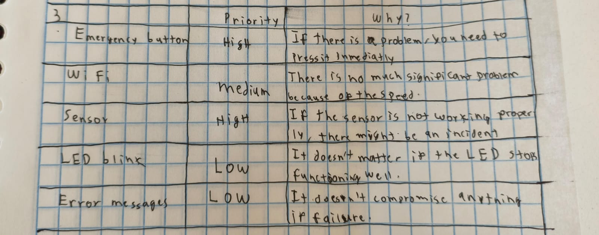

# ASSIGNMENTS OF THE COURSE

---

## Assignment 1: Tasks 1-5

---

### Objective

The goal of this exercise is to train you to identify logical FreeRTOS tasks from system behavior, even when no RTOS code is shown.

You should focus on:

-Timing requirements.

-Blocking behavior.

-Safety and criticality.

-Independent execution flows.


Think in terms of "what must happen independently", not functions or lines of code.

---

### Description

---

The system:

-Reads a temperature sensor every 50 ms.

-Sends sensor data via Wi-Fi every 2 seconds.

-Monitors an emergency button continuously.

-Blinks a status LED at 1 Hz.

-Stores error messages when failures occur.


Assume:

-The system runs on a microcontroller.

-Timing matters.

-Some operations may block (Wi-Fi, storage).


### Exercise 1 - Identify Logical Tasks

List the logical tasks that exist in this system.

{ width="500" align=center}

---

### Exercise 2 - Task Characteristics

For each task you identified, answer the following:

-Is it time-critical? (Yes/No).

-Can it block safely? (Yes/No).

-What happens if this task is delayed?.

Write short, technical answers.

{ width="500" align=center}

---

### Excersice 3 - Priority Reasoning

---

Assign a relative priority to each task:

-High.

-Medium.

-Low.


Then justify each choice in one sentece.

{ width="500" align=center}

---

### Exercise 4 - Design Judgment (Trick Question)

---


Which of the following should NOT necessarily be implemented as a FreeRTOS task?

 -Emergency button monitoring.

 -Wi-Fi trnsmission.

 -Error logging.

 -Status LED blinking.


Explain why in 2-3 sentences.

{ width="500" align=center}

---

## Assignment 2: LAB 1-3

---

### Lab 1

Create two tasks:

**blink_task:** toggles an LED every 300 ms

**hello_task:** prints a message every 1 second

#### What to watch for

- Both tasks run (interleave).
- Changing priority can change which task runs “more” or “first”.
- If you remove a delay from a task, it may hog the CPU.

#### Code Lab 1
```
#include <stdio.h>
#include "freertos/FreeRTOS.h"
#include "freertos/task.h"
#include "driver/gpio.h"
#include "esp_log.h"

#define LED_GPIO GPIO_NUM_2   // CHANGE for your board

static const char *TAG = "LAB1";

static void blink_task(void *pvParameters)
{
    gpio_reset_pin(LED_GPIO);
    gpio_set_direction(LED_GPIO, GPIO_MODE_OUTPUT);

    while (1) {
        gpio_set_level(LED_GPIO, 1);
        vTaskDelay(pdMS_TO_TICKS(300));
        gpio_set_level(LED_GPIO, 0);
        vTaskDelay(pdMS_TO_TICKS(300));
    }
}

static void hello_task(void *pvParameters)
{
    int n = 0;
    while (1) {
        ESP_LOGI(TAG, "hello_task says hi, n=%d", n++);
        vTaskDelay(pdMS_TO_TICKS(1000));
    }
}

void app_main(void)
{
    ESP_LOGI(TAG, "Starting Lab 1 (two tasks)");

    // Stack size in ESP-IDF FreeRTOS is in BYTES
    xTaskCreate(blink_task, "blink_task", 2048, NULL, 5, NULL);
    xTaskCreate(hello_task, "hello_task", 2048, NULL, 5, NULL);
}
```


1. **Priority experiment:** change hello_task priority from 5 to 2.
2. **Does behavior change?** Why might it (or might it not)?
3. **Starvation demo:** temporarily remove vTaskDelay(...) from hello_task.
4. What happens to **blinking**?
5. Put the delay back and explain in one sentence **why blocking helps.**

#### Answers

1.-Priority experiment (hello_task priority 5 → 2):

The blink_task runs more consistently, while hello_task still runs but may execute less frequently.

2.- Does behavior change? Why might it (or might it not)?

The behavior changes slightly because a higher-priority task is scheduled first, but both tasks still run since they block using delays.

3.- Starvation demo (remove vTaskDelay from hello_task):

hello_task runs continuously and at some point the CPU crashes.

4.- What happens to blinking?

The LED stops blinking or becomes very irregular because blink_task is starved of CPU time.

5.- Why blocking helps (one sentence):

Blocking with delays allows to switch tasks fairly and prevents one task from monopolizing the CPU.

### Lab 2

Use a queue to pass integers from a producer task to a consumer task.

**Why it matters:** - Queues are a clean way to pass data without sharing global variables.

#### Code Lab 2
```
#include <stdio.h>
#include "freertos/FreeRTOS.h"
#include "freertos/task.h"
#include "freertos/queue.h"
#include "esp_log.h"

static const char *TAG = "LAB2";
static QueueHandle_t q_numbers;

static void producer_task(void *pvParameters)
{
    int value = 0;

    while (1) {
        value++;

        // Send to queue; wait up to 50ms if full
        if (xQueueSend(q_numbers, &value, pdMS_TO_TICKS(50)) == pdPASS) {
            ESP_LOGI(TAG, "Produced %d", value);
        } else {
            ESP_LOGW(TAG, "Queue full, dropped %d", value);
        }

        vTaskDelay(pdMS_TO_TICKS(200));
    }
}

static void consumer_task(void *pvParameters)
{
    int rx = 0;

    while (1) {
        // Wait up to 1000ms for data
        if (xQueueReceive(q_numbers, &rx, pdMS_TO_TICKS(1000)) == pdPASS) {
            ESP_LOGI(TAG, "Consumed %d", rx);
        } else {
            ESP_LOGW(TAG, "No data in 1s");
        }
    }
}

void app_main(void)
{
    ESP_LOGI(TAG, "Starting Lab 2 (queue)");

    q_numbers = xQueueCreate(5, sizeof(int)); // length 5
    if (q_numbers == NULL) {
        ESP_LOGE(TAG, "Queue create failed");
        return;
    }

    xTaskCreate(producer_task, "producer_task", 2048, NULL, 5, NULL);
    xTaskCreate(consumer_task, "consumer_task", 2048, NULL, 5, NULL);
}
```


1.- **Make the producer faster:** change producer delay 200ms → 20ms.
2.-  When do you see **“Queue full”?**
3.-  Increase the queue length **5 → 20.**
4.-  What changes?
5.-  **Make the consumer “slow”:** after a successful receive, add:
6.-  What pattern is happening now (buffering / backlog)?

#### answers

1.- Make the producer faster (200ms → 20ms):

The producer generates data much faster than the consumer can process it.

2.- When do you see “Queue full”?

Right now it never appears, but it would appear if the producer fills the queue faster than the consumer removes items from it.

3.- Increase the queue length (5 → 20):

The queue can store more items before becoming full.

4.- What changes?

Queue full never appears or takes a lot of time to appear.

5.- Make the consumer “slow”:

After adding a delay, the consumer processes items more slowly than they are produced.

6.- What pattern is happening now (buffering / backlog)?

A backlog forms where items accumulate in the queue faster than they are consumed.

### Lab 3 Mutex

See a race condition happen with a shared counter, then fix it with a mutex.

#### Code Lab 3 Part A

```
#include <stdio.h>
#include "freertos/FreeRTOS.h"
#include "freertos/task.h"
#include "esp_log.h"

static const char *TAG = "LAB3A";

static volatile int shared_counter = 0;

static void increment_task(void *pvParameters)
{
    const char *name = (const char *)pvParameters;

    while (1) {
        // NOT safe: read-modify-write without protection
        int local = shared_counter;
        local++;
        shared_counter = local;

        if ((shared_counter % 1000) == 0) {
            ESP_LOGI(TAG, "%s sees counter=%d", name, shared_counter);
        }

        vTaskDelay(pdMS_TO_TICKS(1));
    }
}

void app_main(void)
{
    ESP_LOGI(TAG, "Starting Lab 3A (race demo)");

    xTaskCreate(increment_task, "incA", 2048, "TaskA", 5, NULL);
    xTaskCreate(increment_task, "incB", 2048, "TaskB", 5, NULL);
}
```
**Why can the counter be wrong?**


Because both tasks access and modify the shared variable at the same time without synchronization, causing race conditions.

#### Code Lab 3 Part B

```
#include <stdio.h>
#include "freertos/FreeRTOS.h"
#include "freertos/task.h"
#include "freertos/semphr.h"
#include "esp_log.h"

static const char *TAG = "LAB3B";

static volatile int shared_counter = 0;
static SemaphoreHandle_t counter_mutex;

static void increment_task(void *pvParameters)
{
    const char *name = (const char *)pvParameters;

    while (1) {
        xSemaphoreTake(counter_mutex, portMAX_DELAY);

        int local = shared_counter;
        local++;
        shared_counter = local;

        xSemaphoreGive(counter_mutex);

        if ((shared_counter % 1000) == 0) {
            ESP_LOGI(TAG, "%s sees counter=%d", name, shared_counter);
        }

        vTaskDelay(pdMS_TO_TICKS(1));
    }
}

void app_main(void)
{
    ESP_LOGI(TAG, "Starting Lab 3B (mutex fix)");

    counter_mutex = xSemaphoreCreateMutex();
    if (counter_mutex == NULL) {
        ESP_LOGE(TAG, "Mutex create failed");
        return;
    }

    xTaskCreate(increment_task, "incA", 2048, "TaskA", 5, NULL);
    xTaskCreate(increment_task, "incB", 2048, "TaskB", 5, NULL);
}
```


1.- **Remove the mutex again.** Do you ever see weird behavior?
2.- **Change priorities:** TaskA priority 6, TaskB priority 4.
3.- What do you expect and why?
4.- **In one sentence:** what does a mutex “guarantee”?

#### answers

1.- Remove the mutex again. Do you ever see weird behavior?

Yes, the counter sometimes skips or repeats values due to race conditions.

2.- Change priorities (TaskA = 6, TaskB = 4):

TaskA runs more often because it has higher priority.

3.- What do you expect and why?

TaskA increments the counter more frequently since the scheduler favors higher-priority tasks.

4.- In one sentence: what does a mutex “guarantee”?

A mutex guarantees exclusive access to a shared variable so only one task can use it at a time.

---

## Task Excercise

---

### Goal

Use the task´s learned commands to create a program that uses 7 different tasks

### What to watch for

-Task 1: Heartbeat

-Task 2: Alive task

-Task 3: Queue Struct Send

-Task 4: Queue Struct Receive

-Task 5 and 6: Mutex reading a button

-Task 7: Error loggin for task 1-6

### Code 
```
#include <stdio.h>
#include <string.h>
#include "freertos/FreeRTOS.h"
#include "freertos/task.h"
#include "freertos/queue.h"
#include "freertos/semphr.h"
#include "driver/gpio.h"
#include "esp_log.h"

#define LED_GPIO GPIO_NUM_20
#define BUTTON   GPIO_NUM_21 

static const char *TAG = "LAB1";

static SemaphoreHandle_t btn_mutex = NULL;
static uint32_t task_counters[6] = {0};

typedef struct {
    char id[20];
    int value;
} DataMessage;

QueueHandle_t structQueue;

static void blink_task(void *pvParameters)
{
    gpio_reset_pin(LED_GPIO);
    gpio_set_direction(LED_GPIO, GPIO_MODE_OUTPUT);

    while (1) {
        task_counters[0]++;
        
        gpio_set_level(LED_GPIO, 1);
        vTaskDelay(pdMS_TO_TICKS(150));
        gpio_set_level(LED_GPIO, 0);
        vTaskDelay(pdMS_TO_TICKS(150));
        gpio_set_level(LED_GPIO, 1);
        vTaskDelay(pdMS_TO_TICKS(150));
        gpio_set_level(LED_GPIO, 0);
        vTaskDelay(pdMS_TO_TICKS(150));
        vTaskDelay(pdMS_TO_TICKS(500));
    }
}

static void Live(void *pvParameters)
{
    while (1) {
        task_counters[1]++;
        ESP_LOGI(TAG, "The pacient is alive (BPM=95)");
        vTaskDelay(pdMS_TO_TICKS(2000));
    }
}

static void sender_task(void *pvParameters)
{
    DataMessage myData;
    strcpy(myData.id, "CHARLY");
    int count = 0;

    while (1) {
        task_counters[2]++;
        myData.value = count;
        
        if (xQueueSend(structQueue, &myData, pdMS_TO_TICKS(100)) == pdPASS) {
             
        }
        
        count++;
        vTaskDelay(pdMS_TO_TICKS(1000)); 
    }
}

static void receiver_task(void *pvParameters)
{
    DataMessage receivedData;

    while (1) {
        task_counters[3]++;

        if (xQueueReceive(structQueue, &receivedData, portMAX_DELAY) == pdTRUE) {
            ESP_LOGI(TAG, "QUEUE RECIEVED, PATIENT: %s, VALUE: %d", receivedData.id, receivedData.value);
        }
    }
}

static void mutex_button_task(void *pvParameters) {
    int task_idx = (int)pvParameters; 
    const char* message = (task_idx == 4) ? "I hate charly" : "I hate Javi";

    while (1) {
        task_counters[task_idx]++;
        
        if (xSemaphoreTake(btn_mutex, portMAX_DELAY) == pdTRUE) {
            
            if (gpio_get_level(BUTTON) == 0) {
                 ESP_LOGI(TAG, "%s", message);
                 vTaskDelay(pdMS_TO_TICKS(200)); 
            }
            
            xSemaphoreGive(btn_mutex); 
        }
        vTaskDelay(pdMS_TO_TICKS(100));
    }
}

static void monitor_task(void *pvParameters) {
    uint32_t last_counters[6] = {0};
    
    while (1) {
        vTaskDelay(pdMS_TO_TICKS(5000));

        for (int i = 0; i < 6; i++) {
            if (task_counters[i] == last_counters[i]) {
                ESP_LOGE("MONITOR", "ERROR: Tarea %d detenida", i);
            } else {
                last_counters[i] = task_counters[i];
            }
        }
    }
}

void app_main(void)
{
    ESP_LOGI(TAG, "Starting Lab 1");

    gpio_reset_pin(BUTTON);
    gpio_set_direction(BUTTON, GPIO_MODE_INPUT);
    gpio_pullup_en(BUTTON);

    structQueue = xQueueCreate(10, sizeof(DataMessage));
    btn_mutex = xSemaphoreCreateMutex();

    if (structQueue == NULL || btn_mutex == NULL) {
        ESP_LOGE(TAG, "Error creating Queue or Mutex");
        return;
    }

    xTaskCreate(blink_task, "blink_task", 2048, NULL, 5, NULL);
    xTaskCreate(Live, "Live", 2048, NULL, 5, NULL);
    xTaskCreate(sender_task, "sender", 2048, NULL, 5, NULL);
    xTaskCreate(receiver_task, "receiver", 2048, NULL, 5, NULL);
    xTaskCreate(mutex_button_task, "BtnCharly", 2048, (void*)4, 5, NULL);
    xTaskCreate(mutex_button_task, "BtnJavi", 2048, (void*)5, 5, NULL);
    xTaskCreate(monitor_task, "Monitor", 2048, NULL, 6, NULL);
}
```
### Evidence

<iframe width="560" height="315" src="https://www.youtube.com/embed/btbJw3lPjE4" title="YouTube video player" frameborder="0" allow="accelerometer; autoplay; clipboard-write; encrypted-media; gyroscope; picture-in-picture; web-share" referrerpolicy="strict-origin-when-cross-origin" allowfullscreen></iframe>