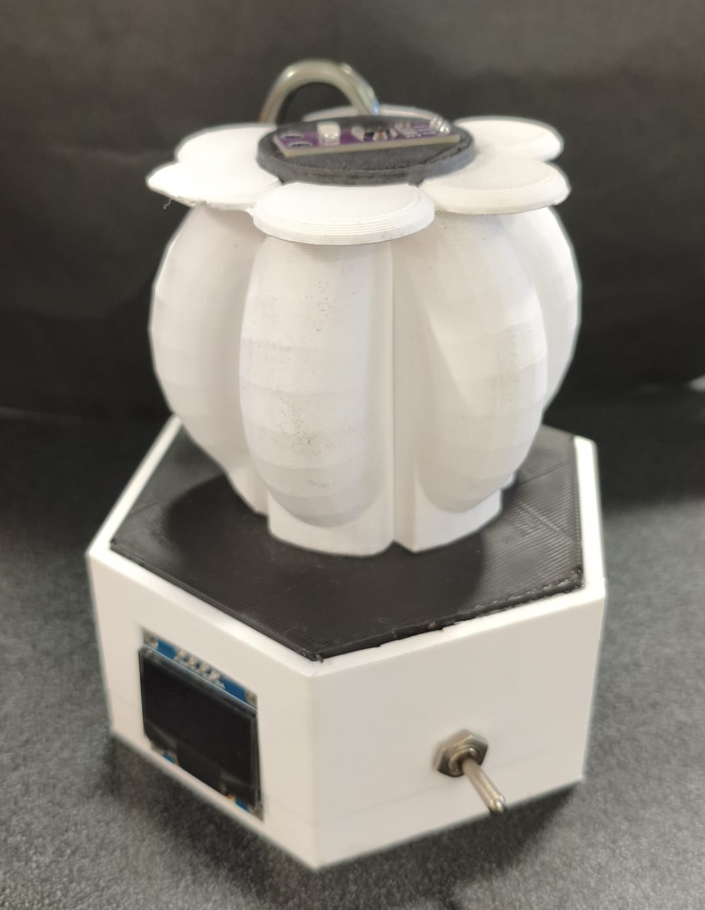

# PROYECTO FINAL

---
Este es el apartado del resultado de nuestro aprendizaje en el curso, que consistió en realizar un sensor de rayos UV que monitoree los datos en tiempo real y, dependiendo de tu configuración de tu tez de piel (Desde muy clara hasta muy oscura), haga cálculos y te notifique si usar bloqueador y en cuánto tiempo reemplazarlo.

---

## Introducción-propuesta

Los rayos UV son uno de los problemas más comunes del día a día para la salud, ya que la exposición prolongada puede ocasionar desde daños leves, envejecimiento acelerado, generación de acné o incluso enfermedades terminales en la piel.

La mayor parte de los daños graves son gracias al descuido o desinformación sobre el impacto del nivel y la alta exposición a los rayos UV. Esto es muy riesgoso, sobretodo en nuestra generación actual, ya que gracias a la contaminación ambiental y la reducción de la capa de ozono estamos viviendo con el nivel de rayos UV más alto registrado hasta la fecha.

Nuestra propuesta es construir un sensor de monitorización de rayos UV barato y personalizable según tu fisionomía de la piel , que monitoree en tiempo real la cantidad de rayos UV que está recibiendo, y accione una alarma que te avise si es necesario ponerse bloqueador, volverse a poner o si no es necesario, podrá ser implementado en diveros equipajes (mochilas, loncheras, bolsas, tableros de auto, etc.).

### Características que debe de tener el producto:

Debe de ser capaz de detectar en tiempo real los niveles de rayos UV en el ambiente y mostrar una alarma o notificación, alertando del riesgo para la piel a tiempo para evitar en mayor medida un daño físico. Debe de ser barato, confiable, fácil de construir, con un diseño amigable, portátil y fácil de implementar.

---

### Link de la presentación

[Presentación de ideas.](https://www.canva.com/design/DAGyy1hqadw/BnHuIFL2b5_UzT2nNvXCFg/edit)

### Boceto

---

{ width="600" align=center}

---

## Desarrollo del proyecto

El proyecto fue diseñado, programado, fabricado y comercializado por nuestro equipo, utilizando múltiples competencias como son el modelado e impresión 3D, diseño de placas tipo PCB, programación avanzada y algoritmos, Metodología de la investigación y márketing profesional.

{ width="250" align=center}
{ width="250" align=center}
{ width="250" align=center}
{ width="250" align=center}

---

### Páginas de trabajo en tiempo real

---

[Página de Trello](https://trello.com/c/4ig0xvoT/10-análisis-de-componentes-y-materiales-para-el-prototipo)

[Página de Jira](https://iberopuebla.atlassian.net/jira/software/projects/MBA/boards/1/timeline)

---

### Mercado y diagrama Porter

---

[IDEO Buisness](https://www.canva.com/design/DAG0w_cchC4/iZkATuicc6fS7nchp_iR7w/edit)

[Sensor de rayos UV](https://docs.google.com/document/d/1EhannVGKgvJBUKr_ac1ZMV9NYwc3UNqIrEO82akdBdE/edit?usp=sharing)

[Diagrama de Porter](https://www.canva.com/design/DAG0xGMiBc4/y4W1TcuNnE4gSCQcIF5zfA/edit?utm_content=DAG0xGMiBc4&utm_campaign=designshare&utm_medium=link2&utm_source=sharebutton)

[Insightful](https://www.canva.com/design/DAG0xcUebPU/UCFHWKUtNRaSE8xj3kxsuA/edit?utm_content=DAG0xcUebPU&utm_campaign=designshare&utm_medium=link2&utm_source=sharebutton)

[Costo de arranque](https://www.canva.com/design/DAG1bsu4Fcg/8mSzcyeuKD5USAmkrbKcHw/edit?utm_content=DAG1bsu4Fcg&utm_campaign=designshare&utm_medium=link2&utm_source=sharebutton)

### Costos del Excell

Hicimos una tabla de costos para nuestro prototipo con el objetivo de tener una visión clara y organizada de los recursos necesarios para su desarrollo desde cero. En ella se desglosan tanto los costos de producción —como materiales, componentes electrónicos, herramientas y mano de obra—, como los costos de distribución que se planean adoptar, incluyendo empaque, transporte y posibles canales de venta, asimismo, se calcularon los impuestos del ISR y del IVA para dar una predicción real de la cantidad de dinero ganada dentro de los 5 años a futuro (VF) desde la inversión (VP). Esta tabla nos permite estimar la viabilidad económica del proyecto y planificar una estrategia de producción sostenible, asegurando que el prototipo no solo sea funcional, sino también accesible y realista para su futura implementación o comercialización.

**Creando la oferta**
Al crear la oferta de nuestro producto, es necesario dividir los costos individuales que se requieren para la producción unitaria de dicho prototipo, de manera que se pueda crear un análisis en relación de todo lo que conlleva hacer que el producto llegue a las manos del usuario como la ganancia que éste va a generar.

[Excell Costos y Ganancias Dermasense](https://iberopuebla-my.sharepoint.com/:x:/g/personal/199064_iberopuebla_mx/ETtlrL8TctJJjXLDC5ySmMsBePAYu9xt0o9-u664iwap0w?e=M54cOA)

---

## Término del proyecto

Se realizó con éxito el prototipo de nuestro proyecto y se presentó frente a catedráticos, haciendo una simulación tipo "Shark tank" a cada uno se le dió dinero simulado con el objetivo de invertirlo en los proyectos que presenten la clase. Aquí pusimos en práctica todo lo que vimos en el curso para poder vender más que una idea, una visión y una inversión muy redituable.

---

### Archivos de documentación final

---

[Excell de ventas](https://iberopuebla-my.sharepoint.com/:x:/g/personal/199064_iberopuebla_mx/ETtlrL8TctJJjXLDC5ySmMsBePAYu9xt0o9-u664iwap0w?e=M54cOA)

[Presentación Power Point de Ventas](https://iberopuebla-my.sharepoint.com/:p:/g/personal/199064_iberopuebla_mx/EeA9Y9_12_5CoPBMZYxGSwUB0eZz8mhkU7vS1wM_9c2KlQ?e=7sr7mJ)

[Documentación del Proyecto Word](https://docs.google.com/document/d/1Aq8cDvQNRT79WB4VP8NVQ41ni2gByOhUjRWilLIoYI8/edit?usp=sharing)