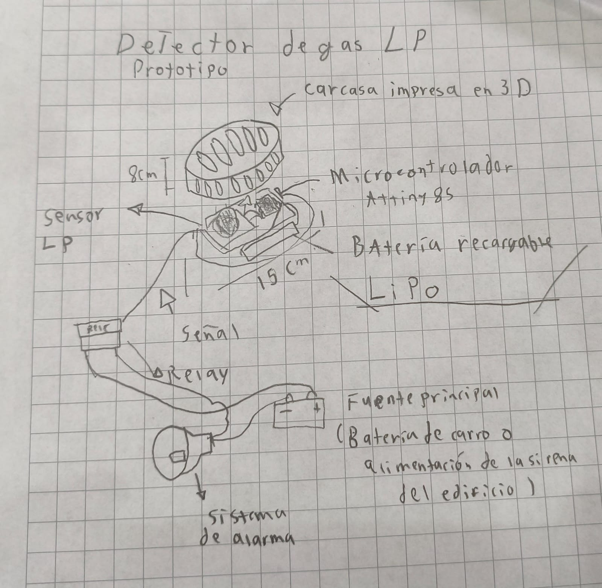

# Propuesta de proyecto

---

## Sensor de Gas LP

---

El gas LP (Licuado de Petróleo) es uno de los recursos más utilizados para el uso doméstico, pero también es uno de los más riesgosos, ya que un descuido de una fuga puede ocasionar una catástrofe en la que puede haber pérdidas materiales o incluso humanas.

La mayor parte de los accidentes graves son gracias al medio de transporte del gas LP, el cual son las pipas. Estas pipas son muy peligrosas, ya que si una de ellas llega a tener una fuga puede ocurrir una explosión a gran escala y hacer daños irreparables en un gran radio de distancia.

Nuestra propuesta es construir un sensor de gas LP barato, que cuando detecte dicho gas, ya sea por una fuga en un departamento o una gran fuga de gas de una pipa, accione una alarma para evacuar la zona, podrá ser implementado en diversas zonas por su portabilidad.

### Características que debe de tener el producto:

Debe de ser capaz de detectar una fuga de Gas LP y hacer sonar una alarma, alertando del peligro a tiempo para evitar en mayor medida un accidente. Debe de ser barato, confiable, fácil de construir y fácil de implementar.

---

### Link de la presentación

[Presentación de ideas.](https://www.canva.com/design/DAGyy1hqadw/BnHuIFL2b5_UzT2nNvXCFg/edit)

### Boceto

---

{ width="600" align=center}

---

### Tarea 1 SYLLABUS Firmado

<embed src="docs/Syllabusfirmado.pdf" type="application/pdf" width="100%" height="600px" />

---

### TAREA 2 Investigación de máquinas de cápsulas de café

[Café en máquina](https://www.canva.com/design/DAGyyk8UNIc/vEBEfNsOicrzrriuVTPqnQ/edit?utm_content=DAGyyk8UNIc&utm_campaign=designshare&utm_medium=link2&utm_source=sharebutton)