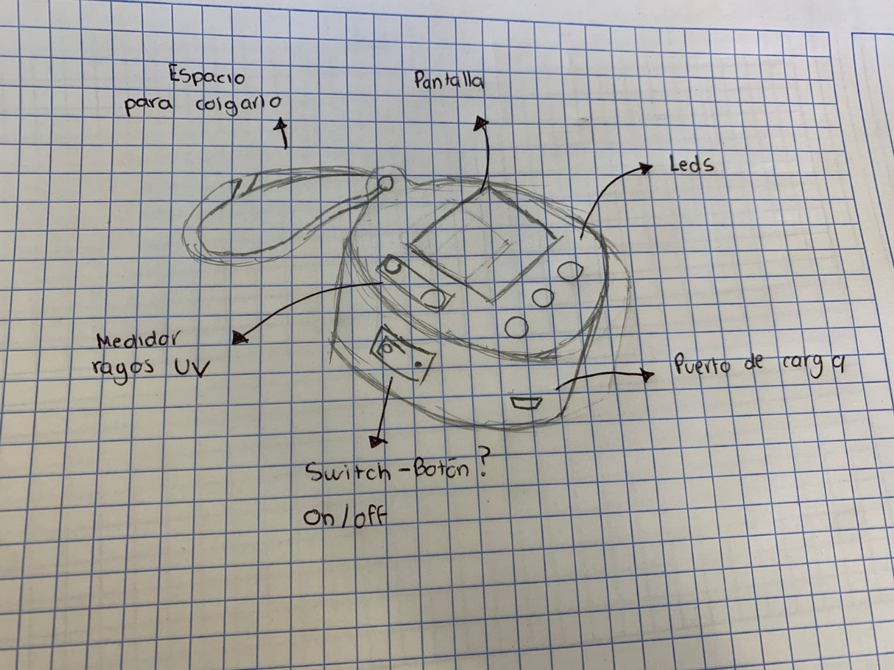

# Propuesta de proyecto

---

## Sensor de rayos UV

---

Los rayos UV son uno de los problemas más comunes del día a día para la salud, ya que la exposición prolongada puede ocasionar desde daños leves, envejecimiento acelerado, generación de acné o incluso enfermedades terminales en la piel.

La mayor parte de los daños graves son gracias al descuido o desinformación sobre el impacto del nivel y la alta exposición a los rayos UV. Esto es muy riesgoso, sobretodo en nuestra generación actual, ya que gracias a la contaminación ambiental y la reducción de la capa de ozono estamos viviendo con el nivel de rayos UV más alto registrado hasta la fecha.

Nuestra propuesta es construir un sensor de monitorización de rayos UV barato y personalizable según tu fisionomía de la piel , que monitoree en tiempo real la cantidad de rayos UV que está recibiendo, y accione una alarma que te avise si es necesario ponerse bloqueador, volverse a poner o si no es necesario, podrá ser implementado en diveros equipajes (mochilas, loncheras, bolsas, tableros de auto, etc.).

### Características que debe de tener el producto:

Debe de ser capaz de detectar en tiempo real los niveles de rayos UV en el ambiente y mostrar una alarma o notificación, alertando del riesgo para la piel a tiempo para evitar en mayor medida un daño físico. Debe de ser barato, confiable, fácil de construir, con un diseño amigable, portátil y fácil de implementar.

---

### Link de la presentación

[Presentación de ideas.](https://www.canva.com/design/DAGyy1hqadw/BnHuIFL2b5_UzT2nNvXCFg/edit)

### Boceto

---

{ width="600" align=center}

---

### Tarea 1 SYLLABUS Firmado

---

[📄 Ver y descargar PDF del Syllabus firmado](Syllabusfirmado.pdf)

---

### TAREA 2 Investigación de máquinas de cápsulas de café

---

[Café de cápsulas](https://www.canva.com/design/DAGyyk8UNIc/vEBEfNsOicrzrriuVTPqnQ/edit?utm_content=DAGyyk8UNIc&utm_campaign=designshare&utm_medium=link2&utm_source=sharebutton)

---

### TAREA 3 Diagrama de Gantt

---

[Diagrama de Gantt proyecto](https://iberopuebla.atlassian.net/jira/software/projects/MBA/list?atlOrigin=eyJpIjoiZWEzNTNhYzEzZTE0NDdhNjgxZmZkZjljMGU0ZGQ4OTUiLCJwIjoiaiJ9)
