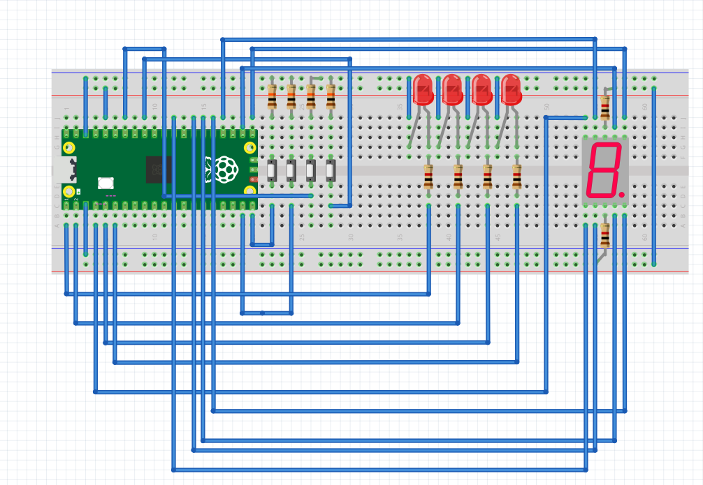

# Examenes Del Curso

---

## Primer Parcial: Simón Dice

---

En este parcial, nuestro reto consistió en hacer utilizando todos los conocimientos previos un juego de simón dice en raspberry Pi Pico 2, con las siguientes normas:

1.- La secuencia crece +1 por ronda, de 1 hasta 15.

2.- La persona jugadora debe repetir la secuencia con 4 botones dentro de un tiempo límite por ronda (En nuestro caso se anuló esta regla porque Sebastián quedó en podio del Kahoot).

3.- Tiempo límite por ronda (fase de entrada): TL = longitud + 5 segundos (p. ej., Ronda 7 → 12 s). (No lo aplicamos).

4.- Puntaje (0–15): mostrar la máxima ronda alcanzada en un display de 7 segmentos en hex (0–9, A, b, C, d, E, F).

5.- Aleatoriedad obligatoria: la secuencia debe ser impredecible en cada ejecución.

### Reglas del juego (obligatorias):

1.- Encendido/Reset: el 7 segmentos muestra “0” y queda en espera de Start (cualquier botón permite iniciar).

2.- Reproducción: mostrar la secuencia actual (LEDs uno por uno con separación clara).

3.- Entrada: al terminar la reproducción, la persona debe repetir la secuencia completa dentro de TL.

4.- Fallo (Game Over): botón incorrecto, falta/extra de entradas o exceder TL.

5.- Progresión: si acierta, puntaje = número de ronda, agrega 1 color aleatorio y avanza.

6.- Fin: al fallar o completar la Ronda 15. Mostrar puntaje final en 7 segmentos (hex).

---

### Programa 

---

```bash

#include "pico/stdlib.h"
#include "hardware/adc.h"
#include <stdlib.h>
#include <time.h>

#define Rondas 15
#define Parpadeo 400
#define Pausa 250
#define Debounce 50

#define LED0 0
#define LED1 1
#define LED2 3
#define LED3 4

#define BTN0 27
#define BTN1 28
#define BTN2 14
#define BTN3 15

#define SegmentoA  16
#define SegmentoB  17
#define SegmentoC  18
#define SegmentoD 26
#define SegmentoDp  20
#define SegmentoE  21
#define SegmentoF  22
#define SegmentoG  2

// arrays de pines para recorrer
const uint LEDS[4] = {LED0, LED1, LED2, LED3};
const uint Botones[4] = {BTN0, BTN1, BTN2, BTN3};
const uint Segmentos[8] = {SegmentoA, SegmentoB, SegmentoC, SegmentoDp, SegmentoE, SegmentoF, SegmentoG, SegmentoD};

//Ánodo común, 0=1, 1=0
const bool MapaDisplay[16][8] = {
    {0,0,0,0,0,0,1,1}, // 0
    {1,0,0,1,1,1,1,1}, // 1
    {0,0,1,0,0,1,0,1}, // 2
    {0,0,0,0,1,1,0,1}, // 3
    {1,0,0,1,1,0,0,1}, // 4
    {0,1,0,0,1,0,0,1}, // 5
    {0,1,0,0,0,0,0,1}, // 6
    {0,0,0,1,1,1,1,1}, // 7
    {0,0,0,0,0,0,0,1}, // 8
    {0,0,0,0,1,0,0,1}, // 9
    {0,0,0,1,0,0,0,1}, // A
    {1,1,0,0,0,0,0,1}, // b
    {0,1,1,0,0,0,1,1}, // C
    {1,0,0,0,0,1,0,1}, // d
    {0,1,1,0,0,0,0,1}, // E
    {0,1,1,1,0,0,0,1}  // F
};

uint8_t Sequencia[Rondas];
int Num_sequencia = 0;

void MuestraDisplay(uint8_t n) {
    for (int i = 0; i < 8; i++) {
        gpio_put(Segmentos[i], MapaDisplay[n & 0xF][i]);
    }
}

void Blink(uint8_t iL, uint32_t ms) {
    gpio_put(LEDS[iL], 1);
    sleep_ms(ms);
    gpio_put(LEDS[iL], 0);
}

int PresionaBoton() {
    while (1) {
        for (int i = 0; i < 4; i++) {
            if (!gpio_get(Botones[i])) { 
                sleep_ms(Debounce);
                while (!gpio_get(Botones[i])); 
                return i;
            }
        }
        sleep_ms(10);
    }
}

void EsperarBoton() {
    while (1) {
        for (int i = 0; i < 4; i++) {
            if (!gpio_get(Botones[i])) {
                sleep_ms(Debounce);
                while (!gpio_get(Botones[i])); // espera a quitar el botón presionado
                return;
            }
        }
        sleep_ms(10);
    }
}

void IniciarLeds() {
    for (int i = 0; i < 4; i++) {
        gpio_init(LEDS[i]);
        gpio_set_dir(LEDS[i], true);
    }
}

void IniciarBotones() {
    for (int i = 0; i < 4; i++) {
        gpio_init(Botones[i]);
        gpio_set_dir(Botones[i], false);
        gpio_pull_up(Botones[i]);
    }
}

void IniciarDisplay() {
    for (int i = 0; i < 8; i++) {
        gpio_init(Segmentos[i]);
        gpio_set_dir(Segmentos[i], true);
    }
}

// Reproduce la secuencia actual
void ReproducirSecuencia(int lim) {
    sleep_ms(300);
    for (int i = 0; i < lim; i++) {
        Blink(Sequencia[i], Parpadeo);
        sleep_ms(Pausa);
    }
}

// Game Over
void GameOver(uint8_t score) {
    MuestraDisplay(score > 15 ? 15 : score);

   
    for (int j = 0; j < 6; j++) {
        for (int i = 0; i < 4; i++) gpio_put(LEDS[i], 1);
        sleep_ms(120);
        for (int i = 0; i < 4; i++) gpio_put(LEDS[i], 0);
        sleep_ms(120);
    }

   
    EsperarBoton();

    Num_sequencia = 0;
    MuestraDisplay(0);
}

// Genera un nuevo color aleatorio y lo agrega a la secuencia
void SiguienteRonda() {
    Sequencia[Num_sequencia++] = rand() & 0x3;
    if (Num_sequencia > Rondas) Num_sequencia = Rondas;
}

bool PresionarSecuencia() { //La función que tiene que hacer el jugador físicamente
    for (int i = 0; i < Num_sequencia; i++) {
        int presionar = PresionaBoton();
        Blink(presionar, 120);
        if (presionar != Sequencia[i]) return false;
    }
    return true;
}


int main() {
    stdio_init_all();
    IniciarLeds();
    IniciarBotones();
    IniciarDisplay();

    // Aleatoriedad: ADC + tiempo
    adc_init();
    adc_gpio_init(26);
    adc_select_input(0);
    uint16_t noise = adc_read();
    srand(to_us_since_boot(get_absolute_time()) ^ noise);

    MuestraDisplay(0);

    while (1) {
        
        EsperarBoton();

        while (1) {
            SiguienteRonda();
            MuestraDisplay(Num_sequencia);
            sleep_ms(400);
            ReproducirSecuencia(Num_sequencia);

            bool Correcto = PresionarSecuencia();

            if (!Correcto) {
                GameOver(Num_sequencia - 1);
                break; // reinicia juego
            }

            if (Num_sequencia >= Rondas) {
                GameOver(Rondas);
                break; // reinicia juego
            }
        }
    }
}

```

---

### Diagrama y video

{ width="600" align=center}

<iframe width="560" height="315"
src="https://www.youtube.com/embed/e2gSABZMsjI"
title="YouTube video player"
frameborder="0"
allow="accelerometer; autoplay; clipboard-write; encrypted-media; gyroscope; picture-in-picture; web-share"
allowfullscreen>
</iframe>

---

## Segundo Parcial: Control de Servomotor

---

En este parcial, nuestro reto consistió en utilizar la conexión con el puerto serial de una raspberry pi pico 2 y hacer un programa en C++ de multifase para mover un sevomotor, con configuraciones que tú puedes establecer, borrar, reproducir indefinidamente o moverlo paso a paso con botones, las reglas son las siguientes:


### Reglas del servo(obligatorias):

**Hardware mínimo**

1 × servomotor en un pin PWM (50 Hz).

3 × botones:

BTN_MODE: cambia el modo activo (cíclico: Entrenamiento → Continuo → Step → …).

BTN_NEXT: avanza a la siguiente posición (sólo en Step).

BTN_PREV: retrocede a la posición anterior (sólo en Step).

Pi pico 2

Modos de operación
1) Modo Entrenamiento
Se recibe texto por USB-serial con los comandos siguientes (se aceptan minúsculas/mayúsculas indistintamente y también sus alias en inglés):

Borrar (alias: clear, borrar)

Sintaxis: Borrar

Efecto: elimina la lista completa de posiciones.

Respuesta: OK.

Escribir (alias: write, escribir)

Sintaxis: Escribir, v1, v2, ..., vn

vi son enteros en 0–180.

Efecto: sobrescribe la lista con los valores dados en ese orden.

Respuesta: OK si todos son válidos y la lisa de posiciones; si alguno está fuera de rango o la lista queda vacía → Error argumento invalido.

Reemplazar (alias: replace, reemplazar)

Sintaxis: Reemplazar, i, v

Índice i en base 1 (1 = primera posición).

v en 0–180.

Efecto: reemplaza el elemento i por v.

Respuesta: OK. Si i no existe → Error indice invalido. Si v fuera de rango → Error argumento invalido.


2) Modo Continuo
Recorre todas las posiciones de la lista en orden, moviendo el servo e imprimiendo cada 1.5 s:

Formato: posX: V (por ejemplo, pos1: 90), donde X es base 1.

Si la lista está vacía: imprimir cada 1.5 s Error no hay pos y no mover el servo.

Al cambiar a otro modo, el ciclo se detiene inmediatamente.


3) Modo Step
BTN_NEXT: avanza una posición (si ya está en la última, se mantiene en esa última).

BTN_PREV: retrocede una posición (si ya está en la primera, se mantiene en la primera).

En cada cambio de posición:

mover el servo a la posición seleccionada;

imprimir posX: V.

Si la lista está vacía: al presionar BTN_NEXT o BTN_PREV, imprimir Error no hay pos y no mover el servo.

**INFO IMPORTANTE**: El movimiento de un servo requiere alimentacion 5-6v y en el pin de signal, un pwm a 50 HZ con un pulso de 1-2ms que representa 0-180 grados

---

### Programa 

---

```bash

#include <stdio.h>
#include <string>
#include <cctype>
#include "pico/stdlib.h"
#include "hardware/pwm.h"
#include "hardware/gpio.h"

using namespace std;

#define SERVO_PIN 2
#define BTN_ATRAS 14
#define BTN_ADELANTE 13
#define BTN_MODE 16
#define UARTID uart0
#define BAUDIOS 115200
#define TX 0
#define RX 1
#define MAX_POS 10
#define TOP 20000

int posiciones[MAX_POS] = {0};
int num_pos = 0;
int modo = 1, idx = 0;
volatile bool cambio_modo = false;

// FUNCIONES 
inline int angle_to_pulse(int a){return 450+(a*1200)/180;}
inline void set_servo(uint s,uint c,int a){pwm_set_chan_level(s,c,angle_to_pulse(a));}

inline void borrar_lista(){
    for(int i=0;i<MAX_POS;i++) 
    posiciones[i]=0;
    num_pos=0;
}
inline bool lista_vacia(){
    if(num_pos==0) return true;
    for(int i=0;i<num_pos;i++) if(posiciones[i]!=0) return false;
    return true;
}
inline void imprimir_lista(){
    printf("Lista actual: ");
    for(int i=0;i<MAX_POS;i++){
        printf("%d",posiciones[i]); if(i<MAX_POS-1)printf(", "); 
    }
    printf("\n");
}
void str_tolower(string &s){for(auto &c:s)c=tolower(c);}

//ISR
void cambio_isr(uint gpio,uint32_t events){cambio_modo=true;}

int main(){
    stdio_init_all();
    sleep_ms(1500);

    uart_init(UARTID,BAUDIOS);
    gpio_set_function(TX,GPIO_FUNC_UART);
    gpio_set_function(RX,GPIO_FUNC_UART);
    uart_set_format(UARTID,8,1,UART_PARITY_NONE);

    // SERVO
    gpio_set_function(SERVO_PIN,GPIO_FUNC_PWM);
    uint slice=pwm_gpio_to_slice_num(SERVO_PIN);
    uint chan=pwm_gpio_to_channel(SERVO_PIN);
    pwm_set_clkdiv(slice,150.0f); 
    pwm_set_wrap(slice,TOP);
    pwm_set_enabled(slice,true);

    gpio_init(BTN_ATRAS
); gpio_set_dir(BTN_ATRAS
    ,false); gpio_pull_up(BTN_ATRAS
);
    gpio_init(BTN_ADELANTE);  gpio_set_dir(BTN_ADELANTE,false);  gpio_pull_up(BTN_ADELANTE);
    gpio_init(BTN_MODE); gpio_set_dir(BTN_MODE,false); gpio_pull_up(BTN_MODE);
    gpio_set_irq_enabled_with_callback(BTN_MODE,GPIO_IRQ_EDGE_FALL,true,&cambio_isr);

    printf("\n=== MODO 1: ENTRENAMIENTO ===\nComandos: escribir / borrar\n");

    string input;
    bool prev_fwd=1,prev_back=1;

    while(true){
        //CAMBIO DE MODO
        if(cambio_modo){
            cambio_modo=false;
            modo=(modo%3)+1;
            idx=0;
            printf("\n=== CAMBIO A MODO %d ===\n",modo);

            if(!lista_vacia()){
                set_servo(slice,chan,posiciones[0]);
                sleep_ms(500);
            }

            if(modo==1) printf("Modo entrenamiento: escribir / borrar\n");
            if(modo==2) printf("Modo repetición automática.\n");
            if(modo==3) printf("Modo paso a paso con botones.\n");
        }

        //MODO 1 
        if(modo==1){
            int ch=getchar_timeout_us(0);
            if(ch!=PICO_ERROR_TIMEOUT){
                if(ch=='\r'||ch=='\n'){
                    if(!input.empty()){
                        string cmd=input; str_tolower(cmd);
                        if(cmd=="borrar"||cmd=="clear"){borrar_lista();printf("OK.\n");imprimir_lista();}
                        else if(cmd.find("escribir")==0||cmd.find("write")==0){
                            printf("¿Cuántos valores (1–10)?: ");
                            fflush(stdout);
                            string n_str;
                            while(true){
                                int c=getchar_timeout_us(0);
                                if(c!=PICO_ERROR_TIMEOUT){
                                    if(c=='\r'||c=='\n')break; n_str+=(char)c;
                                }
                            }
                            int n=stoi(n_str);
                            if(n<1||n>MAX_POS){
                                printf("Fuera de rango.\n");input.clear();continue;
                            }
                            printf("Ingrese %d valores (0–180) separados por espacios:\n",n);
                            fflush(stdout);
                            string val_str;
                            while(true){
                                int c=getchar_timeout_us(0);
                                if(c!=PICO_ERROR_TIMEOUT){
                                    if(c=='\r'||c=='\n')break; val_str+=(char)c;
                                }
                            }
                            borrar_lista();
                            int i=0; size_t pos=0;
                            while(i<n && pos<val_str.size()){
                                size_t e=val_str.find(' ',pos);
                                int v=stoi(val_str.substr(pos,e-pos));
                                if(v<0||v>180){printf("Valor fuera de rango.\n");break;}
                                posiciones[i++]=v;
                                if(e==string::npos)break; pos=e+1;
                            }
                            num_pos=i;
                            printf("OK.\n");imprimir_lista();
                        }
                        else printf("Comando no reconocido.\n");
                        input.clear();
                    }
                } else input+=(char)ch;
            }
        }

        //MODO 2
        else if(modo==2){
            if(lista_vacia()){
                printf("SIN MOVIMIENTO, LISTA EN 0\n");sleep_ms(1000);
            }
            else{
                for(int i=0;i<num_pos;i++){
                    if(cambio_modo)break;
                    set_servo(slice,chan,posiciones[i]);
                    sleep_ms(1000);
                }
            }
        }

        //MODO 3
        else if(modo==3){
            if(lista_vacia()){
                printf("SIN MOVIMIENTO, LISTA EN 0\n");sleep_ms(1000);
            }
            else{
                set_servo(slice,chan,posiciones[idx]);
                bool fwd=gpio_get(BTN_ADELANTE);
                bool back=gpio_get(BTN_ATRAS
            );

                if(!fwd && prev_fwd){ 
                    if(idx<num_pos-1 && posiciones[idx+1]!=0){
                        idx++;set_servo(slice,chan,posiciones[idx]);
                        printf("Avance a paso %d (%d°)\n",idx+1,posiciones[idx]);
                    } else printf("Fin de secuencia.\n");
                }
                if(!back && prev_back){
                    if(idx>0){
                        idx--;set_servo(slice,chan,posiciones[idx]);
                        printf("Retroceso a paso %d (%d°)\n",idx+1,posiciones[idx]);
                    } else printf("Inicio de secuencia.\n");
                }
                prev_fwd=fwd; 
                prev_back=back;
                sleep_ms(100);
            }
        }

        sleep_ms(10);
    }
}

```

---

### Video


<iframe width="560" height="315"
src="https://www.youtube.com/embed/r94heoq_Mww"
title="YouTube video player"
frameborder="0"
allow="accelerometer; autoplay; clipboard-write; encrypted-media; gyroscope; picture-in-picture; web-share"
allowfullscreen>
</iframe>

---
