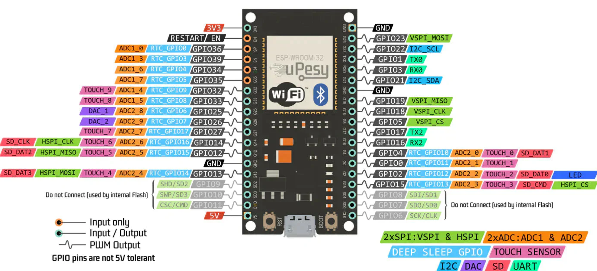
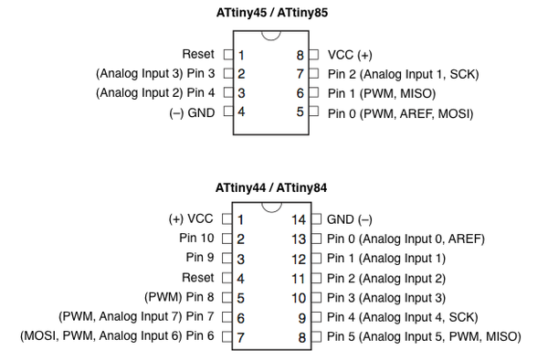
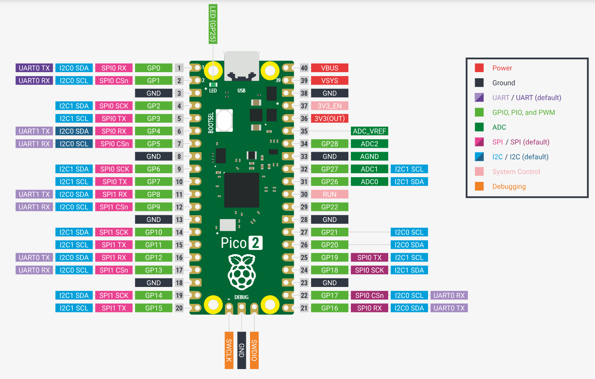
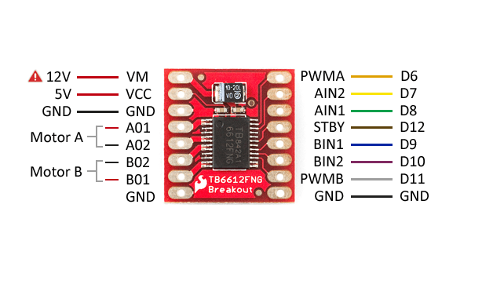
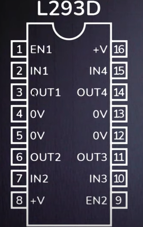

# PINOUTS

---

En esta sección de mi página colocaré los pinouts que encuentre de las placas que ocupamos, esto con la finalidad de tener a la mano toda la información necesaria para hacer diversos proyectos.

---

## **Microcontroladores**

---

## ESP32

{ width="600" align=center}

---

## XIAO ESP32-C3

{ width="600" align=center}

---

### Attiny 85

{ width="500" align=center}

---

### Raspberry Pi Pico 2

{ width="600" align=center}

---

## **Puentes H**

### TB6612FNG

{ width="600" align=center}

---

### L293D

**Nota**: Este puente h es pequeño, adaptable a la protoboard pero su desventaja es que como funciona con 5v se volvió obsoleto ante los microcontroladores modernos que usan 3.3v para funcionar, así que lo más recomendable es utilizar Arduino UNO.

{ width="200" align=center}