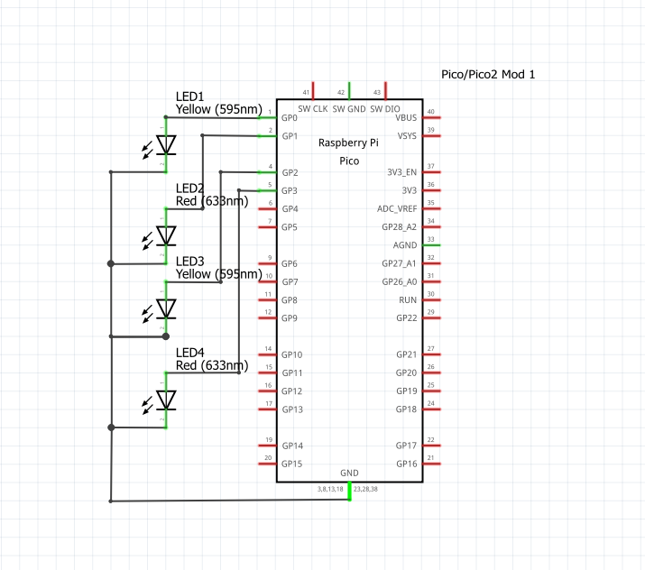

# TAREAS DEL CURSO

---

## Tarea 1: Cuadro comparativo

---

En esta tarea se realizará un cuadro comparativo entre 4 microcontroladores reconocidos, tomando en cuenta varias características, también los voy a rankear por puesto y diré cuál es mejor para mí y el por qué.

---


| Parámetro        | Arduino Uno (ATmega328P) | ESP32 | PIC16F877A | Raspberry Pi Pico 2 (RP2350) |
|------------------|--------------------------|-------|------------|------------------------------|
| **Periféricos**  | 14 GPIO, 6 entradas ADC, PWM, UART, SPI| Más de 30 GPIO, WiFi, Bluetooth, ADC, DAC, PWM, UART, SPI | 33 GPIO, 8 canales ADC, UART, SPI, PWM | 30 GPIO, 3 UART, 2 SPI, PWM, ADC, PIO programables, USB, soporte para memoria externa |
| **Memoria**      | 32 KB Flash, 2 KB SRAM   | Hasta 4 MB Flash, 520 KB SRAM | 14 KB Flash, 368 Bytes RAM | 520 KB SRAM, soporte para hasta 128 MB Flash externa |
| **Ecosistema**   | El más usado en las escuelas por su simpleza y librerías fáciles | Amplio en IoT, soporte para programar en Arduino IDE, ESP-IDF | Utilizado mucho en industria y un poco en educación, ecosistema más limitado pero optimizado| Ecosistema en constante crecimiento, soporte C/C++, Python y SDK oficial de Raspberry Pi |
| **Costos (aprox.)** | 160-240 MX | 100-200 MX (según versión) | 120-200 MX | 120-160 MX |
| **Arquitectura** | AVR de 8 bits | Tensilica Xtensa LX6 o RISC-V de 32 bits | PIC de 8 bits | ARM Cortex-M33, 32 bits dual-core |
| **Velocidad de trabajo** | 16 MHz | 160 – 240 MHz | 20 MHz | Hasta 150 MHz en dual-core |


# RANKING

---

Aquí está el ranking de los microcontroladores, lo hice en mi opinión tomando en cuenta todas las características de la tabla. 

---


| Microcontrolador        | Posición | ¿Por qué ese ranking en mi opinión? | ¿Por qué los elegí? |
|--------------------------|:--------:|-------------------------------------|----------------------|
| **ESP32**               | 1        | Es simple, potente, barato, se conecta Wi-Fi y Bluetooth y se puede utilizar en proyectos avanzados | Lo elegí porque es muy reconocible, lo hemos utilizado en producción electrónica (XIAO ESP32) y porque yo sé que en un futuro lo voy a ocupar más seriamente |
| **Raspberry Pi Pico 2** | 2        | Es muy potente y rápido, tiene bastante memoria y tiene un potencial muy bueno porque su ecosistema sigue en crecimiento, por lo tanto, es mucho mejor que Arduino para proyectos serios | Lo elegí porque siento que tiene muchísimo más potencial que Arduino que me encanta, quiero aprender sobre ese microcontrolador y porque utilizaré la rama de Raspberry muchísimo en todo lo que sigue de la carrera |
| **Arduino UNO**         | 3        | Es híper simple, el mejor para la enseñanza en la escuela para empezar con los microcontroladores, pero es muy lento en sus ciclos y en su forma de ejecutar el programa final si son muchas instrucciones | Lo elegí porque gracias a este microcontrolador me apasioné por la mecatrónica y los robots potenciados por Arduino, es muy sencillo y divertido de aprender y te da libertad creativa con muchos componentes que utilizar, lo coloqué en este rango porque yo sé que tiene un límite y es lento y poco eficaz comparado con otros microcontroladores que voy a utilizar a lo largo de mi carrera |
| **PIC16F877A**          | 4        | Es muy utilizado en la industria por su optimización y simpleza, pero en los tiempos actuales se está quedando un poco obsoleto porque no tiene tanta memoria y es un poco más lento | Lo elegí porque siento que si me voy a un área laboral muy industrial tarde o temprano voy a terminar trabajando con este microcontrolador, o por lo menos, con unos parecidos |


---

## Tarea 2: Outputs básicos

---
En esta tarea tuvimos que realizar 3 programas distintos, en los cuales trabajamos en la primera un contador binario de 4 bits, en la segunda una secuencia de barrido y la última una secuencia en formato Gray, igualmente de 4 bits.

###Primer_programa

Lo que hace este programa es representar en una cadena de 4 LEDS un contador en binario representando los 1 y 0 en encendido y apagado.

---
```bash

#include "pico/stdlib.h"
 
#define LEDS_MASK ((1<<0) | (1<<1) | (1<<3) | (1<<4))  
 
int main() {
    stdio_init_all();
 
   
    gpio_init(0); gpio_set_dir(0, GPIO_OUT);
    gpio_init(1); gpio_set_dir(1, GPIO_OUT);
    gpio_init(3); gpio_set_dir(3, GPIO_OUT);
    gpio_init(4); gpio_set_dir(4, GPIO_OUT);
 
    int estado = 0;
 
    while (1) {
       
        for (estado = 0; estado < 16; estado++) {
           
            gpio_put(0, estado & (1<<0));
            gpio_put(1, estado & (1<<1));
            gpio_put(3, estado & (1<<2));  
            gpio_put(4, estado & (1<<3));
            sleep_ms(500);
        }
    }
}
```
---
### Esquemáticos y videos
---
