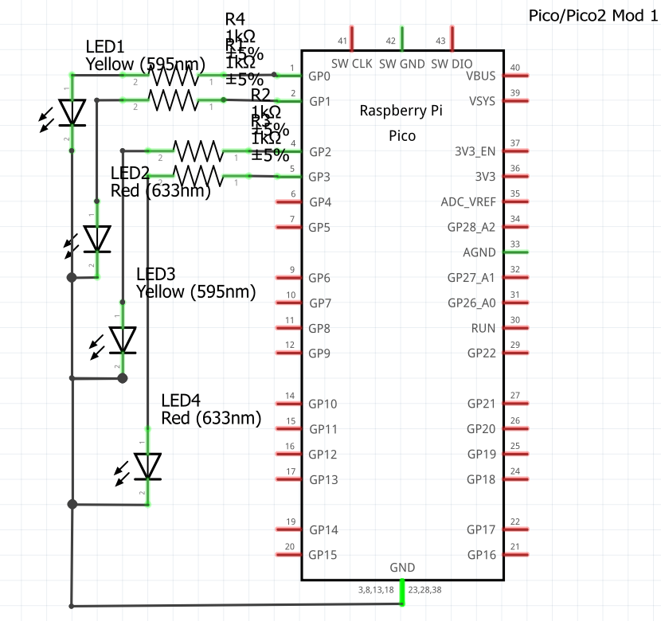
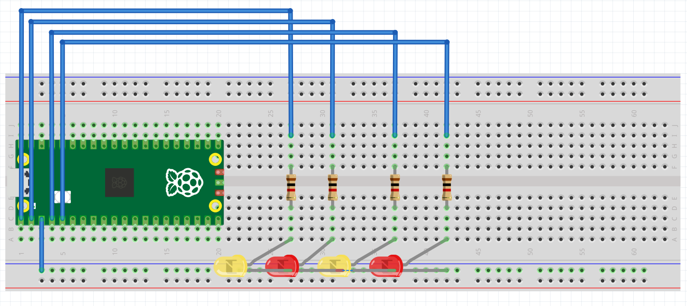

# TAREAS DEL CURSO

---

## Tarea 1: Cuadro comparativo

---

En esta tarea se realizará un cuadro comparativo entre 4 microcontroladores reconocidos, tomando en cuenta varias características, también los voy a rankear por puesto y diré cuál es mejor para mí y el por qué.

---


| Parámetro        | Arduino Uno (ATmega328P) | ESP32 | PIC16F877A | Raspberry Pi Pico 2 (RP2350) |
|------------------|--------------------------|-------|------------|------------------------------|
| **Periféricos**  | 14 GPIO, 6 entradas ADC, PWM, UART, SPI| Más de 30 GPIO, WiFi, Bluetooth, ADC, DAC, PWM, UART, SPI | 33 GPIO, 8 canales ADC, UART, SPI, PWM | 30 GPIO, 3 UART, 2 SPI, PWM, ADC, PIO programables, USB, soporte para memoria externa |
| **Memoria**      | 32 KB Flash, 2 KB SRAM   | Hasta 4 MB Flash, 520 KB SRAM | 14 KB Flash, 368 Bytes RAM | 520 KB SRAM, soporte para hasta 128 MB Flash externa |
| **Ecosistema**   | El más usado en las escuelas por su simpleza y librerías fáciles | Amplio en IoT, soporte para programar en Arduino IDE, ESP-IDF | Utilizado mucho en industria y un poco en educación, ecosistema más limitado pero optimizado| Ecosistema en constante crecimiento, soporte C/C++, Python y SDK oficial de Raspberry Pi |
| **Costos (aprox.)** | 160-240 MX | 100-200 MX (según versión) | 120-200 MX | 120-160 MX |
| **Arquitectura** | AVR de 8 bits | Tensilica Xtensa LX6 o RISC-V de 32 bits | PIC de 8 bits | ARM Cortex-M33, 32 bits dual-core |
| **Velocidad de trabajo** | 16 MHz | 160 – 240 MHz | 20 MHz | Hasta 150 MHz en dual-core |


### RANKING

---

Aquí está el ranking de los microcontroladores, lo hice en mi opinión tomando en cuenta todas las características de la tabla. 

---


| Microcontrolador        | Posición | ¿Por qué ese ranking en mi opinión? | ¿Por qué los elegí? |
|--------------------------|:--------:|-------------------------------------|----------------------|
| **ESP32**               | 1        | Es simple, potente, barato, se conecta Wi-Fi y Bluetooth y se puede utilizar en proyectos avanzados | Lo elegí porque es muy reconocible, lo hemos utilizado en producción electrónica (XIAO ESP32) y porque yo sé que en un futuro lo voy a ocupar más seriamente |
| **Raspberry Pi Pico 2** | 2        | Es muy potente y rápido, tiene bastante memoria y tiene un potencial muy bueno porque su ecosistema sigue en crecimiento, por lo tanto, es mucho mejor que Arduino para proyectos serios | Lo elegí porque siento que tiene muchísimo más potencial que Arduino que me encanta, quiero aprender sobre ese microcontrolador y porque utilizaré la rama de Raspberry muchísimo en todo lo que sigue de la carrera |
| **Arduino UNO**         | 3        | Es híper simple, el mejor para la enseñanza en la escuela para empezar con los microcontroladores, pero es muy lento en sus ciclos y en su forma de ejecutar el programa final si son muchas instrucciones | Lo elegí porque gracias a este microcontrolador me apasioné por la mecatrónica y los robots potenciados por Arduino, es muy sencillo y divertido de aprender y te da libertad creativa con muchos componentes que utilizar, lo coloqué en este rango porque yo sé que tiene un límite y es lento y poco eficaz comparado con otros microcontroladores que voy a utilizar a lo largo de mi carrera |
| **PIC16F877A**          | 4        | Es muy utilizado en la industria por su optimización y simpleza, pero en los tiempos actuales se está quedando un poco obsoleto porque no tiene tanta memoria y es un poco más lento | Lo elegí porque siento que si me voy a un área laboral muy industrial tarde o temprano voy a terminar trabajando con este microcontrolador, o por lo menos, con unos parecidos |


---

## Tarea 2: Outputs básicos

---

En esta tarea tuvimos que realizar 3 programas distintos, en los cuales trabajamos en la primera un contador binario de 4 bits, en la segunda una secuencia de barrido y la última una secuencia en formato Gray, igualmente de 4 bits.

### Primer_programa

Lo que hace este programa es representar en una cadena de 4 LEDS un contador en binario representando los 1 y 0 en encendido y apagado.

---

```bash

#include "pico/stdlib.h"
 
#define LEDS_MASK ((1<<0) | (1<<1) | (1<<3) | (1<<4))  
 
int main() {
    stdio_init_all();
 
   
    gpio_init(0); gpio_set_dir(0, GPIO_OUT);
    gpio_init(1); gpio_set_dir(1, GPIO_OUT);
    gpio_init(3); gpio_set_dir(3, GPIO_OUT);
    gpio_init(4); gpio_set_dir(4, GPIO_OUT);
 
    int estado = 0;
 
    while (1) {
       
        for (estado = 0; estado < 16; estado++) {
           
            gpio_put(0, estado & (1<<0));
            gpio_put(1, estado & (1<<1));
            gpio_put(3, estado & (1<<2));  
            gpio_put(4, estado & (1<<3));
            sleep_ms(500);
        }
    }
}
```

---

### Esquemáticos y videos

---

{ width="500" align=center}
{ width="600" align=center}

<iframe width="560" height="315"
src="https://www.youtube.com/embed/WPuGgSJhCBk"
title="YouTube video player"
frameborder="0"
allow="accelerometer; autoplay; clipboard-write; encrypted-media; gyroscope; picture-in-picture; web-share"
allowfullscreen>
</iframe>

---

### Segundo_Programa

---

Lo que hace el segundo programa es representar un barrido de ida y vuelta de una línea de 4 LEDS, con el patrón 0-1-2-3-2-1-0, encendiendo el pin seleccionado en el momento y apagando el resto.

---

```bash

#include "pico/stdlib.h"

#define LED0 0   
#define LED1 1   
#define LED2 3   
#define LED3 4   

#define LED_MASK ((1u << LED0) | (1u << LED1) | (1u << LED2) | (1u << LED3))

const uint LEDS[4] = {LED0, LED1, LED2, LED3}; // lo hice así para no repetir 4 lineas de código

int main() {
    for (int i = 0; i < 4; i++) {
        gpio_init(LEDS[i]);
        gpio_set_dir(LEDS[i], true);
    }

    int posicion = 0; 
    int dir = 1;   

    while (true) {
        gpio_clr_mask(LED_MASK); // Importante limpiar todos los LEDs

        uint32_t bit = (1u << LEDS[posicion]);  
        gpio_set_mask(bit);      

        sleep_ms(300);

        posicion += dir;

        if (posicion == 4 || posicion == -1) {
            gpio_clr_mask(LED_MASK);
            dir = -dir;  
        }
    }
}

```

---

### Esquemáticos y videos

---

{ width="500" align=center}
{ width="600" align=center}

<iframe width="560" height="315"
src="https://www.youtube.com/embed/y7T2UWbOsAI"
title="YouTube video player"
frameborder="0"
allow="accelerometer; autoplay; clipboard-write; encrypted-media; gyroscope; picture-in-picture; web-share"
allowfullscreen>
</iframe>

---

### Tercer_Programa

---

Lo que hace el tercer programa se parece un poco al contador binario del primer programa, pero lo que hace es representar con LEDs una secuencia llamada Números Gray, convirtiendo una secuencia de binario a Gray y los representa en su línea de 4 LEDs con el 1 como encendido y 0 como apagado.

---

```bash

#include "pico/stdlib.h"
 
int main() {
 
    const uint LEDS[] = {0, 1, 3, 4};
    const int Cantidad = 4;
 
   
    for (int i = 0; i < Cantidad; i++) {//Para evitar código si son muchos pines
        gpio_init(LEDS[i]);
        gpio_set_dir(LEDS[i], GPIO_OUT);
    }
 
    while (true) {
       
        for (int n = 0; n < 16; n++) {
            int gray = n ^ (n >> 1); // Fórmula para convertir a Gray
 
           
            for (int i = 0; i < Cantidad; i++) {
                int bit = (gray >> i) & 1;
                gpio_put(LEDS[i], bit);
            }
 
            sleep_ms(500);
        }
    }
}

```

---

### Esquemáticos y videos

---

{ width="500" align=center}
{ width="600" align=center}

<iframe width="560" height="315"
src="https://www.youtube.com/embed/dRX9EdW8nDc"
title="YouTube video player"
frameborder="0"
allow="accelerometer; autoplay; clipboard-write; encrypted-media; gyroscope; picture-in-picture; web-share"
allowfullscreen>
</iframe>

---

## Tarea 3 Inputs 

---

En esta tarea nos encargaron hacer 2 programas para Raspberry Pi Pico 2, utilizando inputs de 2 botones distintos para hacer encender una cadena de LEDs de cierta manera que detallaré en cada programa.

---

### Primer programa

Este primer programa consistió en hacer 3 compuertas lógicas: AND, OR y XOR, programando entradas con 2 botones en C y ejecutando en el microcontrolador para encender 3 LEDs, cada LED con la salida de las distintas compuertas.

---

```bash

#include "pico/stdlib.h"
#include "hardware/gpio.h"

#define LED   0
#define LED2    1
#define LED3   3

#define Boton1   5
#define Boton2   6

int main() {

    gpio_init(LED);
    gpio_set_dir(LED, true);

    gpio_init(LED2);
    gpio_set_dir(LED2, true);

    gpio_init(LED3);
    gpio_set_dir(LED3, true);

    gpio_init(Boton1);
    gpio_set_dir(Boton1, false);
    gpio_pull_up(Boton1);

    gpio_init(Boton2);
    gpio_set_dir(Boton2, false);
    gpio_pull_up(Boton2);

    while (true) {
        // Se invierte para que sea Pull-up
        uint32_t b1 = !gpio_get(Boton1);
        uint32_t b2 = !gpio_get(Boton2);

        uint32_t AND = b1 & b2;   
        uint32_t OR  = b1 | b2; 
        uint32_t XOR = b1 ^ b2; 

        gpio_clr_mask((1u << LED) | (1u << LED2) | (1u << LED3));
        gpio_set_mask((AND << LED) |
                      (OR  << LED2)  |
                      (XOR << LED3));
    }
}
```

---

### Esquemáticos y videos

---

{ width="500" align=center}
{ width="600" align=center}

<iframe width="560" height="315"
src="https://www.youtube.com/embed/bSNO7ncCw5g"
title="YouTube video player"
frameborder="0"
allow="accelerometer; autoplay; clipboard-write; encrypted-media; gyroscope; picture-in-picture; web-share"
allowfullscreen>
</iframe>

---

## Segundo programa

Este segundo programa consistió en hacer una secuencia en cadenita, al igual que el programa de la cadena en la segunda tarea , programando entradas con 2 botones en C y ejecutando en el microcontrolador para encender la fila de 4 LEDs, cada LED con la salida de la numeración correspondiente.

---

```bash

#include "pico/stdlib.h"
 
#define LED0 0  
#define LED1 1  
#define LED2 3  
#define LED3 4  
 
#define Boton1 5
#define Boton2 6
 
#define LED_MASK ((1u << LED0) | (1u << LED1) | (1u << LED2) | (1u << LED3))
 
const uint LEDS[4] = {LED0, LED1, LED2, LED3};
 
int main() {
    stdio_init_all();
 
    for (int i = 0; i < 4; i++) {
        gpio_init(LEDS[i]);
        gpio_set_dir(LEDS[i], true);
    }
 
    gpio_init(Boton1);
    gpio_set_dir(Boton1, false);  
    gpio_pull_up(Boton1);
 
    gpio_init(Boton2);
    gpio_set_dir(Boton2, false);  
    gpio_pull_up(Boton2);
 
    int posicion = 0;
    uint32_t Estadob1 = true;
    uint32_t Estadob2 = true;
 
    while (true) {
        // Poner posición actual
        gpio_clr_mask(LED_MASK);
        gpio_set_mask(1u << LEDS[posicion]);
 
       
        uint32_t Avance = gpio_get(Boton1);
        uint32_t Retroceso = gpio_get(Boton2);
 
        if (!Avance && Estadob1) {
            posicion++;
            if (posicion > 3) posicion = 0;
        }
 
        if (!Retroceso && Estadob2) {
            posicion--;
            if (posicion < 0) posicion = 3;
        }
 
        Estadob1 = Avance;
        Estadob2 = Retroceso;
 
        sleep_ms(20);
    }
}
```

---

### Esquemáticos y videos

---

{ width="500" align=center}
{ width="600" align=center}

<iframe width="560" height="315"
src="https://www.youtube.com/embed/tf33W2s8G6I"
title="YouTube video player"
frameborder="0"
allow="accelerometer; autoplay; clipboard-write; encrypted-media; gyroscope; picture-in-picture; web-share"
allowfullscreen>
</iframe>

---

## Tarea 4 PONG con interrupciones

---

En esta tarea nos encargaron programar un mini-Pong con 5 LEDs en línea y 2 botones usando interrupciones (ISR) para registrar el “golpe” del jugador exactamente cuando la “pelota” (un LED encendido) llega al extremo de su lado. 

### REGLAS

**Pelota**: es un único LED encendido que se mueve automáticamente de un extremo al otro (L1→L5→L1…) a un ritmo fijo.

**Golpe con ISR**: cada botón genera una interrupción.

El BTN_L solo cuenta si, en el instante de la ISR, la pelota está en L1.

El BTN_R solo cuenta si, en el instante de la ISR, la pelota está en L5.

Si coincide, la pelota rebota: invierte su dirección.

**Fallo y punto**: si la pelota alcanza L1 y no hubo golpe válido del lado izquierdo en ese momento, anota el jugador derecho. Análogamente, si alcanza L5 sin golpe válido, anota el jugador izquierdo.

**Indicador de punto**: al anotar, se parpadea el LED de punto 3 veces del jugador que metió el punto .

**Reinicio tras punto**: después del parpadeo, la pelota se reinicia en el centro (L3) y comienza a moverse hacia el jugador que metió el punto.

**Inicio del juego**: al encender, la pelota inicia en L3 y no se mueve hasta que se presione un boton y debera moverse a la direccion opuesta del boton presionado.

---

### Programa


```bash

#include "pico/stdlib.h"
#include "hardware/gpio.h"

#define Led 0
#define Led2 1
#define Led3 2   // LED central
#define Led4 3
#define Led5 4
#define Led6p 6  
#define Led7p 8   

#define BotonIzq 14     
#define BotonDer 15     

#define LED_MASK ((1u << Led) | (1u << Led2) | (1u << Led3) | (1u << Led4) | (1u << Led5))

const uint LEDS[5] = {Led, Led2, Led3, Led4, Led5};
int posicion = 2;  
int dir = 1;        
bool fallo = false;
int fallo_jugador = -1; 

// ISR para botones
void boton_isr(uint gpio, uint32_t events) {
    if (posicion == 0 && gpio == BotonIzq) {
        dir = 1;
    } else if (posicion == 4 && gpio == BotonDer) {
        dir = -1;
    } else {
        fallo = true;
        if (gpio == BotonIzq) {
            fallo_jugador = 0; 
        } else if (gpio == BotonDer) {
            fallo_jugador = 1; 
        }
    }
}


void Inicioled() {
    for (int i = 0; i < 3; i++) {
        gpio_put(Led3, 1);
        sleep_ms(500);
        gpio_put(Led3, 0); 
        sleep_ms(500);
    }
}

int main() {
    stdio_init_all();

    for (int i = 0; i < 5; i++) {
        gpio_init(LEDS[i]);
        gpio_set_dir(LEDS[i], true);
    }

    gpio_init(Led6p);
    gpio_set_dir(Led6p, true);
    gpio_init(Led7p);
    gpio_set_dir(Led7p, true);

    gpio_init(BotonIzq);
    gpio_set_dir(BotonIzq, false);
    gpio_pull_up(BotonIzq);
    gpio_set_irq_enabled_with_callback(BotonIzq, GPIO_IRQ_EDGE_FALL, true, &boton_isr);

    gpio_init(BotonDer);
    gpio_set_dir(BotonDer, false);
    gpio_pull_up(BotonDer);
    gpio_set_irq_enabled_with_callback(BotonDer, GPIO_IRQ_EDGE_FALL, true, &boton_isr);

  
    Inicioled();

    while (true) {
        gpio_clr_mask(LED_MASK); 
        gpio_set_mask(1u << LEDS[posicion]); 

        sleep_ms(300);

        if (fallo) {
            gpio_clr_mask(LED_MASK);

            if (fallo_jugador == 0) {
                gpio_put(Led6p, 1);
                sleep_ms(5000);
                gpio_put(Led6p, 0);
            } else if (fallo_jugador == 1) {
                gpio_put(Led7p, 1);
                sleep_ms(5000);
                gpio_put(Led7p, 0);
            }

            // reiniciar juego
            fallo = false;
            fallo_jugador = -1;
            posicion = 2;
            dir = 1;

        
            Inicioled();
            continue;
        }

        posicion += dir;

        // Rebote fallido
        if (posicion < 0) {
            fallo = true;
            fallo_jugador = 0;
        } else if (posicion > 4) {
            fallo = true;
            fallo_jugador = 1;
        }
    }
}
```

---

### Esquemáticos y videos

---

{ width="500" align=center}
{ width="600" align=center}

<iframe width="560" height="315"
src="https://www.youtube.com/embed/WDvfNiqJyws"
title="YouTube video player"
frameborder="0"
allow="accelerometer; autoplay; clipboard-write; encrypted-media; gyroscope; picture-in-picture; web-share"
allowfullscreen>
</iframe>

---

## Tarea 5 Ejercicios de medición

---

### Medición en osciloscopio del periodo y jitter usando ALARM0 (modo µs)

Genera una onda cuadrada por toggle de un pin de salida en la ISR de ALARM0, con rearme acumulativo y periodo nominal definido por ti (p. ej., 100 µs–5 ms). Mide con osciloscopio:

Periodo promedio y tolerancia.

Jitter pico-a-pico y, si tu equipo lo permite, RMS. Describe la configuración del osciloscopio (acoplamiento, escala de tiempo/voltaje, modo de medición). No cambiar la resolución del timer (mantener modo µs).

### **Evidencia**

{ width="600" align=center}

### Programa

---

```bash

// Blink con timer (SDK alto nivel): cambia BLINK_MS para ajustar
#include "pico/stdlib.h"
#include "pico/time.h"

#define LED_PIN PICO_DEFAULT_LED_PIN
static const int BLINK_MS = 1000;  // <-- ajusta tu periodo aquí

bool blink_cb(repeating_timer_t *t) {
    static bool on = false;
    gpio_put(LED_PIN, on = !on);
    return true; // seguir repitiendo la alarma
}

int main() {
    stdio_init_all();

    gpio_init(LED_PIN);
    gpio_set_dir(LED_PIN, true);

    repeating_timer_t timer;
    // Programa una interrupción periódica cada BLINK_MS:
    add_repeating_timer_ms(BLINK_MS, blink_cb, NULL, &timer);

    while (true) {
        // El trabajo "pesado" debería ir aquí (no en la ISR).
        tight_loop_contents();
    }
}
```

---

### Diagrama

---

{ width="600" align=center}

---

**Análisis**

Al generar una señal por medio de temporizadores, al momento de medirla en el osciloscopio se pudo observar el pequeño delay que se genera al usar este modo.

Se configuró el osciloscopio con un voltaje de 1V, para así poder observar correctamente las señales. El tiempo de parpadeo era de 1 segundo y en el osciloscopio se obtuvo un ciclo de 1.001 s. Es decir que tiene un delay de 1 milisegundo

### Comparar jitter/precisión con osciloscopio: modo µs vs modo ciclos

Genera una señal por toggle en la ISR de ALARM0, primero en modo µs y luego en modo ciclos de clk_sys (mismo periodo nominal). En ambos casos:

Usa rearme acumulativo.

Mantén el resto del código idéntico. Con el osciloscopio, mide y registra para cada modo:

Periodo promedio y desviación respecto al nominal.

Jitter pico-a-pico y/o RMS. Compara resultados y discute el compromiso entre resolución de tick y horizonte de programación.


### **Evidencia**

{ width="600" align=center}

### Programa

---

```bash

// Blink con timer de sistema (bajo nivel): programando ALARM0 e IRQ
#include "pico/stdlib.h"
#include "hardware/irq.h"
#include "hardware/structs/timer.h"

#define LED_PIN       PICO_DEFAULT_LED_PIN
#define ALARM_NUM     0  // usaremos la alarma 0

// Calcula el número de IRQ para esa alarma 
#define ALARM_IRQ     timer_hardware_alarm_get_irq_num(timer_hw, ALARM_NUM)

static volatile uint32_t next_deadline;   // próximo instante (en us) en 32 bits bajos
// Por defecto el timer cuenta µs (no cambiamos la fuente).
static volatile uint32_t intervalo_us = 1000000u;    // periodo en microsegundos

void on_alarm_irq(void) {
    // 1) Limpiar el flag de la alarma
    hw_clear_bits(&timer_hw->intr, 1u << ALARM_NUM);

    // 2) Hacer el trabajo toggle LED
    sio_hw->gpio_togl = 1u << LED_PIN;

    // 3) Rearmar la siguiente alarma con "deadline acumulativo"
    next_deadline += intervalo_us;
    timer_hw->alarm[ALARM_NUM] = next_deadline;
}

int main() {
    stdio_init_all();

    // Configurar el LED
    gpio_init(LED_PIN);
    gpio_set_dir(LED_PIN, true);

    // "now" = 32 bits bajos del contador (tiempo en µs)
    uint32_t now_us = timer_hw->timerawl;          // lectura 32b (low) del contador
    next_deadline = now_us + intervalo_us;         // primer deadline

    // Programar la alarma
    timer_hw->alarm[ALARM_NUM] = next_deadline;

    // Crea un handler exclusivo para ligar el callback a la IRQ de la alarma
    irq_set_exclusive_handler(ALARM_IRQ, on_alarm_irq);
    // Habilitar dentro del periférico TIMER la fuente de interrupción para la alarma ALARM_NUM inte = interrupt enable
    hw_set_bits(&timer_hw->inte, 1u << ALARM_NUM);
    //Habilitar la IRQ en el NVIC (controlador de interrupciones del núcleo)
    irq_set_enabled(ALARM_IRQ, true);

    while (true) {
        // Mantener el bucle principal libre; lo pesado va aquí, no en la ISR
        tight_loop_contents();
    }
}
```

---

### Diagrama

---

{ width="600" align=center}

---

### **Comparación**

Al comparar los dos modos, se encontró una diferencia entre el modo µs vs ciclos. El modo ciclos es más preciso y no genera ningún delay perceptible en el osciloscopio a diferncia del modo µs que tiene una diferencia de 1 ms.

Con esta información se puede concluir que para tener un timer preciso el uso de los ciclos es el ideal y el mejor para implementar en futuros proyectos, ya que genera un timer óptimo y sin delays.

---

## Tarea 6 Ejercicios de programación

---

Esta tarea consistió en aprender a hacer programas utilizando timers y alarmas para hacer programas más optimizados.

---

### Primera actividad

--- 

Esta actividad consistió en que, utilizando alarmas, encender y apagar simultáneamente 4 LEDs a velocidades distintas.

### Programa 

---

```bash

#include "pico/stdlib.h"
#include "hardware/irq.h"
#include "hardware/structs/timer.h"
#include "hardware/gpio.h"

#define LED0_PIN     0
#define LED1_PIN     1
#define LED2_PIN     3
#define LED3_PIN     4

#define ALARM0_NUM   0
#define ALARM1_NUM   1
#define ALARM2_NUM   2
#define ALARM3_NUM   3

static volatile uint32_t next0_us, next1_us, next2_us, next3_us;
static const uint32_t INTERVALO0_US = 200000u;
static const uint32_t INTERVALO1_US = 400000u;
static const uint32_t INTERVALO2_US = 600000u;
static const uint32_t INTERVALO3_US = 800000u;

// ISR ÚNICA para el TIMER
static void on_timer_irq(void) {
    uint32_t status = timer_hw->intr;  
    timer_hw->intr = status;

    if (status & (1u << ALARM0_NUM)) {
        sio_hw->gpio_togl = 1u << LED0_PIN;
        next0_us += INTERVALO0_US;
        timer_hw->alarm[ALARM0_NUM] = next0_us;
    }
    if (status & (1u << ALARM1_NUM)) {
        sio_hw->gpio_togl = 1u << LED1_PIN;
        next1_us += INTERVALO1_US;
        timer_hw->alarm[ALARM1_NUM] = next1_us;
    }
    if (status & (1u << ALARM2_NUM)) {
        sio_hw->gpio_togl = 1u << LED2_PIN;
        next2_us += INTERVALO2_US;
        timer_hw->alarm[ALARM2_NUM] = next2_us;
    }
    if (status & (1u << ALARM3_NUM)) {
        sio_hw->gpio_togl = 1u << LED3_PIN;
        next3_us += INTERVALO3_US;
        timer_hw->alarm[ALARM3_NUM] = next3_us;
    }
}

int main() {
    gpio_init(LED0_PIN); gpio_set_dir(LED0_PIN, GPIO_OUT); gpio_put(LED0_PIN, 0);
    gpio_init(LED1_PIN); gpio_set_dir(LED1_PIN, GPIO_OUT); gpio_put(LED1_PIN, 0);
    gpio_init(LED2_PIN); gpio_set_dir(LED2_PIN, GPIO_OUT); gpio_put(LED2_PIN, 0);
    gpio_init(LED3_PIN); gpio_set_dir(LED3_PIN, GPIO_OUT); gpio_put(LED3_PIN, 0);

    timer_hw->source = 0u;

    uint32_t now_us = timer_hw->timerawl;

    next0_us = now_us + INTERVALO0_US;
    next1_us = now_us + INTERVALO1_US;
    next2_us = now_us + INTERVALO2_US;
    next3_us = now_us + INTERVALO3_US;

    timer_hw->alarm[ALARM0_NUM] = next0_us;
    timer_hw->alarm[ALARM1_NUM] = next1_us;
    timer_hw->alarm[ALARM2_NUM] = next2_us;
    timer_hw->alarm[ALARM3_NUM] = next3_us;

    hw_clear_bits(&timer_hw->intr,
                  (1u << ALARM0_NUM) |
                  (1u << ALARM1_NUM) |
                  (1u << ALARM2_NUM) |
                  (1u << ALARM3_NUM));

    int irq_num = timer_hardware_alarm_get_irq_num(timer_hw, 0);
    irq_set_exclusive_handler(irq_num, on_timer_irq);

    hw_set_bits(&timer_hw->inte,
                (1u << ALARM0_NUM) |
                (1u << ALARM1_NUM) |
                (1u << ALARM2_NUM) |
                (1u << ALARM3_NUM));

    irq_set_enabled(irq_num, true);

    while (true) {
        tight_loop_contents();
    }
}

```

---

### Diagrama y video

{ width="600" align=center}

<iframe width="560" height="315"
src="https://www.youtube.com/embed/6Aigsqccans"
title="YouTube video player"
frameborder="0"
allow="accelerometer; autoplay; clipboard-write; encrypted-media; gyroscope; picture-in-picture; web-share"
allowfullscreen>
</iframe>

---

### Segunda actividad

---

Esta actividad consistió en modificar el programa del Pong, colocándole 2 botones extras que al presionarlos, aumenten o disminuyan la velocidad del barrido de los LEDs.

### Programa 

---

```bash

#include "pico/stdlib.h"
#include "hardware/gpio.h"

#define Leds 5
#define Delayminimo 100
#define Delaymaximo 1000
#define Delay 100

const uint Boton1 = 14;     
const uint Boton2 = 15;  
const uint Botonmasvel = 13;  
const uint Botonmenosvel = 12;
const uint LEDS[Leds] = {0, 1, 2, 3, 4};
const uint LedP1 = 6;    // LED indicador derecha
const uint LedP2 = 8;    // LED indicador izquierda

volatile bool Reb1 = false;
volatile bool Reb2 = false;
volatile bool Subiovel = false;
volatile bool Bajovel = false;

void button_isr(uint gpio, uint32_t events) {
    if (gpio == Boton1) Reb1 = true;
    else if (gpio == Boton2) Reb2 = true;
    else if (gpio == Botonmasvel) Subiovel = true;
    else if (gpio == Botonmenosvel) Bajovel = true;
}

void score_point(uint led) {
    for (int i = 0; i < 3; i++) {
        gpio_put(led, 1);
        sleep_ms(150);
        gpio_put(led, 0);
        sleep_ms(150);
    }
}

int main() {
    // Anotación de puntos
    gpio_init(LedP1); gpio_set_dir(LedP1, true);
    gpio_init(LedP2); gpio_set_dir(LedP2, true);

    
    gpio_init(Boton1); gpio_set_dir(Boton1, false); gpio_pull_up(Boton1);
    gpio_set_irq_enabled_with_callback(Boton1, GPIO_IRQ_EDGE_FALL, true, &button_isr);

    gpio_init(Boton2); gpio_set_dir(Boton2, false); gpio_pull_up(Boton2);
    gpio_set_irq_enabled(Boton2, GPIO_IRQ_EDGE_FALL, true);

    gpio_init(Botonmasvel); gpio_set_dir(Botonmasvel, false); gpio_pull_up(Botonmasvel);
    gpio_set_irq_enabled(Botonmasvel, GPIO_IRQ_EDGE_FALL, true);

    gpio_init(Botonmenosvel); gpio_set_dir(Botonmenosvel, false); gpio_pull_up(Botonmenosvel);
    gpio_set_irq_enabled(Botonmenosvel, GPIO_IRQ_EDGE_FALL, true);

    // LEDs del juego
    for (int i = 0; i < Leds; i++) {
        gpio_init(LEDS[i]);
        gpio_set_dir(LEDS[i], true);
    }

    int current_led = Leds / 2;
    int direction = 0;
    bool game_started = false;
    int delay_ms = 400; // velocidad inicial

    gpio_put(LEDS[current_led], 1);

    while (true) {
        // Ajustar velocidad
        if (Subiovel) {
            if (delay_ms > Delayminimo) delay_ms -= Delay;
            Subiovel = false;
        }
        if (Bajovel) {
            if (delay_ms < Delaymaximo) delay_ms += Delay;
            Bajovel = false;
        }

        
        if (!game_started) {
            if (Reb1) { direction = 1; game_started = true; Reb1 = false; gpio_put(LEDS[current_led], 0);}
            else if (Reb2) { direction = -1; game_started = true; Reb2 = false; gpio_put(LEDS[current_led], 0);}
            else continue;
        }

        gpio_put(LEDS[current_led], 1);
        sleep_ms(delay_ms);  //el delay depende del botón
        gpio_put(LEDS[current_led], 0);

        current_led += direction;

        if (current_led == -1) {
            if (Reb1) { direction = 1; current_led = 0; Reb1 = false; }
            else { score_point(LedP1); current_led = Leds/2; direction = 1; }
        }
        if (current_led == Leds) {
            if (Reb2) { direction = -1; current_led = Leds - 1; Reb2 = false; }
            else { score_point(LedP2); current_led = Leds/2; direction = -1; }
        }
    }
}

```

---

### Diagrama y video

{ width="600" align=center}

<iframe width="560" height="315"
src="https://www.youtube.com/embed/k_8adMmJoM0"
title="YouTube video player"
frameborder="0"
allow="accelerometer; autoplay; clipboard-write; encrypted-media; gyroscope; picture-in-picture; web-share"
allowfullscreen>
</iframe>